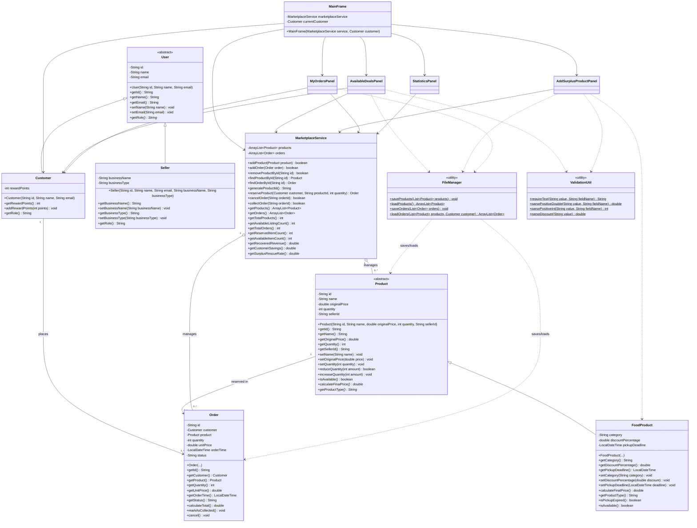

# SaveBite UML Class Diagram

```mermaid
classDiagram

direction TB

class User {
    <<abstract>>
    -String id
    -String name
    -String email
    +User(String id, String name, String email)
    +getId() String
    +getName() String
    +getEmail() String
    +setName(String name) void
    +setEmail(String email) void
    +getRole()* String
}

class Customer {
    -int rewardPoints
    +Customer(String id, String name, String email)
    +getRewardPoints() int
    +addRewardPoints(int points) void
    +getRole() String
}

class Seller {
    -String businessName
    -String businessType
    +Seller(String id, String name, String email, String businessName, String businessType)
    +getBusinessName() String
    +setBusinessName(String businessName) void
    +getBusinessType() String
    +setBusinessType(String businessType) void
    +getRole() String
}

class Product {
    <<abstract>>
    -String id
    -String name
    -double originalPrice
    -int quantity
    -String sellerId
    +Product(String id, String name, double originalPrice, int quantity, String sellerId)
    +getId() String
    +getName() String
    +getOriginalPrice() double
    +getQuantity() int
    +getSellerId() String
    +setName(String name) void
    +setOriginalPrice(double price) void
    +setQuantity(int quantity) void
    +reduceQuantity(int amount) boolean
    +increaseQuantity(int amount) void
    +isAvailable() boolean
    +calculateFinalPrice()* double
    +getProductType()* String
}

class FoodProduct {
    -String category
    -double discountPercentage
    -LocalDateTime pickupDeadline
    +FoodProduct(...)
    +getCategory() String
    +getDiscountPercentage() double
    +getPickupDeadline() LocalDateTime
    +setCategory(String category) void
    +setDiscountPercentage(double discount) void
    +setPickupDeadline(LocalDateTime deadline) void
    +calculateFinalPrice() double
    +getProductType() String
    +isPickupExpired() boolean
    +isAvailable() boolean
}

class Order {
    -String id
    -Customer customer
    -Product product
    -int quantity
    -double unitPrice
    -LocalDateTime orderTime
    -String status
    +Order(...)
    +getId() String
    +getCustomer() Customer
    +getProduct() Product
    +getQuantity() int
    +getUnitPrice() double
    +getOrderTime() LocalDateTime
    +getStatus() String
    +calculateTotal() double
    +markAsCollected() void
    +cancel() void
}

class MarketplaceService {
    -ArrayList~Product~ products
    -ArrayList~Order~ orders
    +addProduct(Product product) boolean
    +addOrder(Order order) boolean
    +removeProductById(String id) boolean
    +findProductById(String id) Product
    +findOrderById(String id) Order
    +generateProductId() String
    +reserveProduct(Customer customer, String productId, int quantity) Order
    +cancelOrder(String orderId) boolean
    +collectOrder(String orderId) boolean
    +getProducts() ArrayList~Product~
    +getOrders() ArrayList~Order~
    +getTotalProducts() int
    +getAvailableListingCount() int
    +getTotalOrders() int
    +getReservedItemCount() int
    +getAvailableItemCount() int
    +getRecoveredRevenue() double
    +getCustomerSavings() double
    +getSurplusRescueRate() double
}

class FileManager {
    <<utility>>
    +saveProducts(List~Product~ products)$ void
    +loadProducts()$ ArrayList~Product~
    +saveOrders(List~Order~ orders)$ void
    +loadOrders(List~Product~ products, Customer customer)$ ArrayList~Order~
}

class ValidationUtil {
    <<utility>>
    +requireText(String value, String fieldName)$ String
    +parsePositiveDouble(String value, String fieldName)$ double
    +parsePositiveInt(String value, String fieldName)$ int
    +parseDiscount(String value)$ double
}

class MainFrame {
    -MarketplaceService marketplaceService
    -Customer currentCustomer
    +MainFrame(MarketplaceService service, Customer customer)
}

class AvailableDealsPanel
class AddSurplusProductPanel
class MyOrdersPanel
class StatisticsPanel

User <|-- Customer
User <|-- Seller

Product <|-- FoodProduct

Customer "1" --> "0..*" Order : places
Product "1" --> "0..*" Order : reserved in

MarketplaceService "1" o-- "0..*" Product : manages
MarketplaceService "1" o-- "0..*" Order : manages

FileManager ..> Product : saves/loads
FileManager ..> Order : saves/loads

MainFrame --> MarketplaceService
MainFrame --> Customer

MainFrame --> AvailableDealsPanel
MainFrame --> AddSurplusProductPanel
MainFrame --> MyOrdersPanel
MainFrame --> StatisticsPanel

AvailableDealsPanel --> MarketplaceService
AvailableDealsPanel --> Customer
AvailableDealsPanel ..> FileManager
AvailableDealsPanel ..> ValidationUtil

AddSurplusProductPanel --> MarketplaceService
AddSurplusProductPanel ..> FoodProduct
AddSurplusProductPanel ..> FileManager
AddSurplusProductPanel ..> ValidationUtil

MyOrdersPanel --> MarketplaceService
MyOrdersPanel --> Customer
MyOrdersPanel ..> FileManager

StatisticsPanel --> MarketplaceService
```